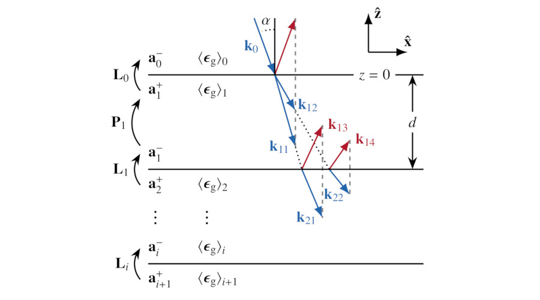

# Radio-wave transfer matrix model for glacier ice
Model of electromagnetic plane-wave propagation through a column of polycrystalline ice, composed of vertically-stacked, horizontally-homogeneous layers with unconsrained permittivity tensors (orientation fabrics).

**Documentation:** 
Rathmann et al, 2021 (in prep.)

**Acknowledgements:** 
Builds on work by Yeh (1980), Xu and others (2000), Passler and Paarmann (2017), Passler and others (2020), and Jeannin (2019).

# How to use

See the Jupyter notebook for a demonstration of how to use the model (`experiments/demo/demo.ipynb`)

In short, the model layer stack is initialized by specifying either the spectral coefficients of the fabric orientation distribution function (ODF) with depth, or by specifying the second-order structure tensor with depth. 
Thereafter, radar returns can easily be calculated and plotted by specifying the characteristics of the transmitted plane wave.
